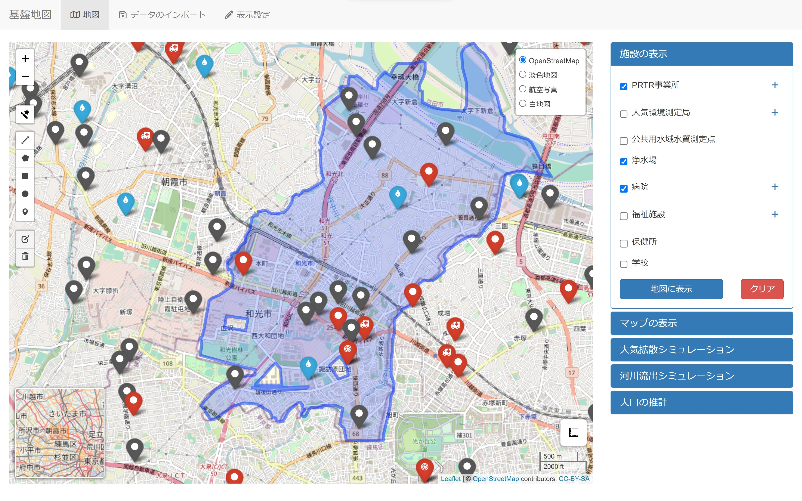
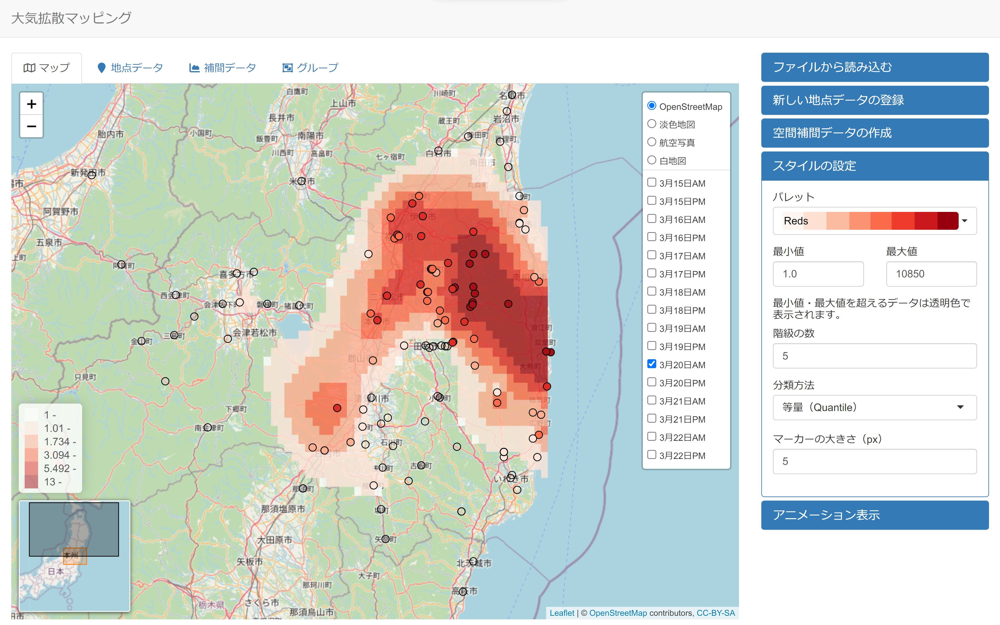
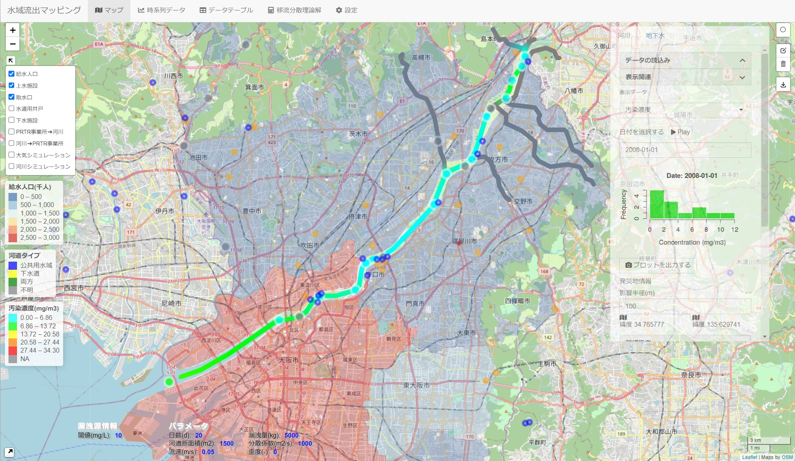
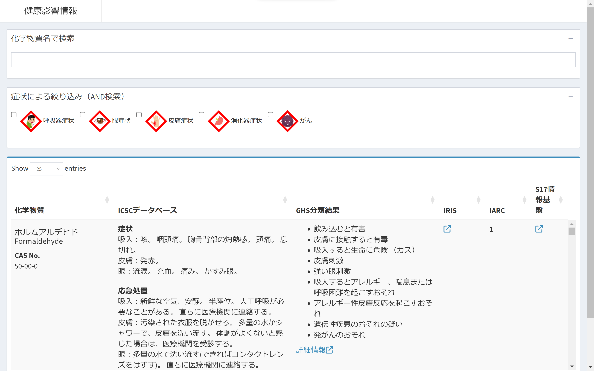
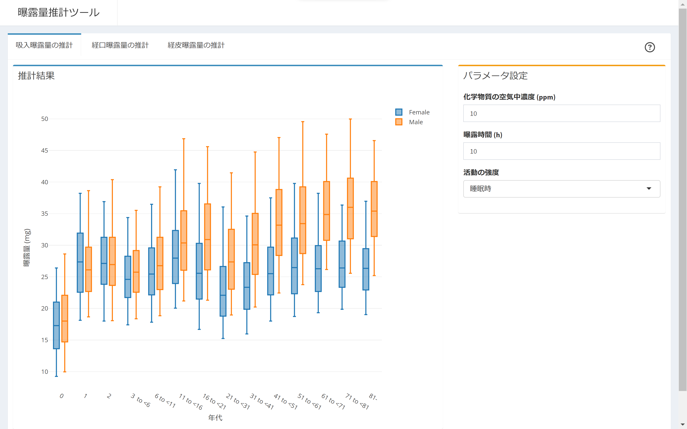

化学物質等の流出やその拡散への初期対応を支援する、化学物質リスク管理のための迅速対応統合プラットフォームの開発を行いました。

[ダウンロードはこちら](https://github.com/tkhrotn/s17-2-4/releases/download/v0.1/sample-win32-x64.zip)

## スクリーンショット
### 基盤地図情報ツール

### 大気拡散マッピングツール

### 水域流出マッピングツール

### 健康影響情報検索ツール

### 曝露量推計ツール

## 研究メンバー
 * 高橋邦彦 (東京医科歯科大学 M&Dデータ科学センター、S17-2(4)サブテーマリーダー)
 * 若井建志 (名古屋大学 大学院医学系研究科)
 * 菱田朝陽 (愛知医科大学 医学部)
 * 大谷隆浩 (名古屋市立大学 大学院医学研究科)
 * 浅見真理 (国立保健医療科学院 生活環境研究部、S17-2テーマリーダー)

## 謝辞
本プラットフォームは環境省・（独）環境再生保全機構の環境研究総合推進費「戦略的研究開発課題 S-17：災害・事故に起因する化学物質リスクの評価・管理手法の体系的構築に関する研究」（JPMEERF18S11700）（2018–2022年度）のサブテーマの一部として開発されたものです。

## リンク
 * 環境研究総合推進費 戦略的研究開発課題S-17 [災害・事故に起因する化学物質リスクの評価・管理手法の体系的構築に関する研究](https://www.nies.go.jp/res_project/s17/)
